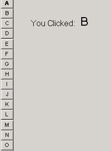



## AlphaBar OCX \- Easy sorting of lists using intuitive alphabet control\.

### Description

Very basic example of creating a user control. This one has actually turned out to be useful in an application I wrote. I kept the features to a minimum in this one so that it would be easier to see how it works.
 
### More Info
 
Remember, to use it in an application, you must add a reference to it in your project.

Selected Letter (in event)

             |
---                |---
**Submitted On**   |2001-04-13 11:04:52
**By**             |[Matthew Roberts](https://github.com/Planet-Source-Code/PSCIndex/blob/master/ByAuthor/matthew-roberts.md)
**Level**          |Intermediate
**User Rating**    |3.8 (15 globes from 4 users)
**Compatibility**  |VB 4\.0 \(32\-bit\), VB 5\.0, VB 6\.0
**Category**       |[Custom Controls/ Forms/  Menus](https://github.com/Planet-Source-Code/PSCIndex/blob/master/ByCategory/custom-controls-forms-menus__1-4.md)
**World**          |[Visual Basic](https://github.com/Planet-Source-Code/PSCIndex/blob/master/ByWorld/visual-basic.md)
**Archive File**   |[AlphaBar O183194132001\.zip](https://github.com/Planet-Source-Code/matthew-roberts-alphabar-ocx-easy-sorting-of-lists-using-intuitive-alphabet-control__1-22037/archive/master.zip)

